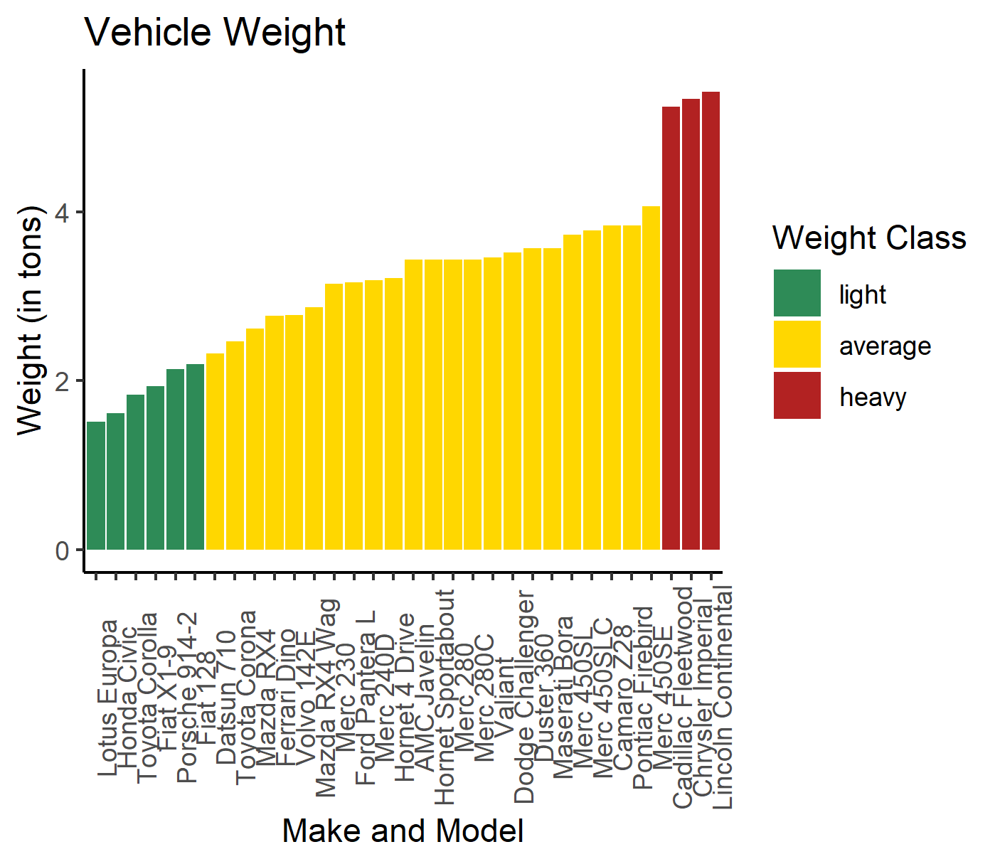

# Car Weight Classes

Script and visualization produced for a blog post: https://maryfalling.wordpress.com/2021/01/27/r-default-parameters-a-ggplot-geom_bar-example/

Cut-off values were created using the mean and standard deviation to create buckets for weight weights: Light, Medium, and Heavy.

A bar chart visualization was created in R using the results.

